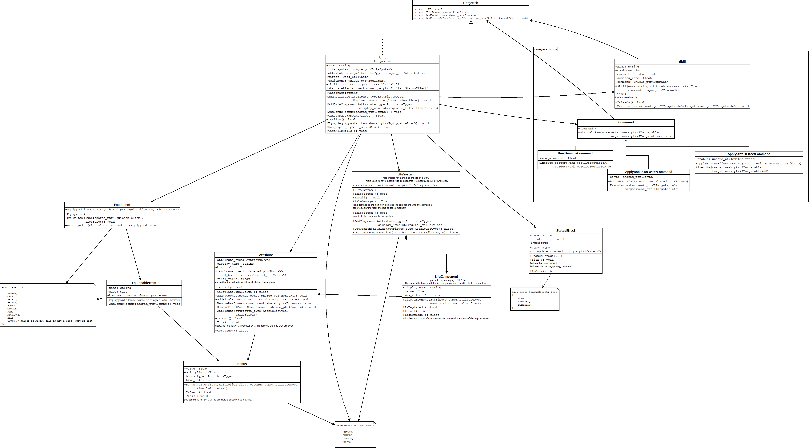

# Human VS Orc

This project is a small simulation of a battle between two RPG units (a human and an orc).

## Goal of this project
The goal of this project is to have a **clean code architecture** and **be modular** to add easily new class, skills or attributes.

See the [Class Diagram](#class-diagram) for more details about the architecture design.

More info soon.

### How to add a new RPG Class

Let's say you want to add a new RPG class called ``Paladin``. Here are the steps to follow:

TODO (need to define some RPG classes first)


### How to create a new Skill

Skills are implemented using the [Command Pattern](https://refactoring.guru/design-patterns/command). To create a new skill, you just need to instantiate a new ``Skill`` object with the desired ``Command`` object.

For instance, to create a Fireball skill and add it to the unit, you can do the following using the ``DealDamageCommand`` command:

```c++
Unit unit;
float fireball_damage = 15.0f;
int cooldown = 3; // 3 turns
float success_rate = 0.95f; // 95% chance to succeed
unit.AddSkill(std::make_unique<Skill>("Fireball", cooldown, success_rate, std::make_unique<DealDamageCommand>(fireball_damage)));
```

A ``SkillFactory`` is also available to create predefined skills, e.g. ``SkillFactory::CreateChargeSkill()`` which returns a ``unique_ptr<Skill>``.


### How to add a new RPG attribute

It's easy to add a new attribute to the RPG system and add it to any unit. Not all units are required to have all attributes.

1. First add a new attribute type in the ``AttributeType`` enum in ``AttributeType.h``. For instance ``DEXTERITY``.
2. Then we can just add this attribute at runtime to any unit using the ``AddAttribute`` method. For instance:
```c++
Unit unit;
float base_value = 10.0f;
std::string display_name = "Dexterity";
unit.AddAttribute(AttributeType::DEXTERITY, display_name, base_value);
```

## How to install

TODO

## Unit Testing

Unit testing is done with [Google Test](https://    github.com/google/googletest). The tests are located in the `TestProject` project.

### How to run the tests
Either run the project in Rider or Visual Studio, or execute ``.\HumanVSOrc\x64\Debug\TestProject.exe``

### Test coverage

I'm using [OpenCppCoverage](https://github.com/OpenCppCoverage/OpenCppCoverage) to generate the test coverage. To generate the report, run the following command in the root directory of the project:

```bash
OpenCppCoverage.exe --sources HumanVSOrc --excluded_sources gtest --excluded_sources Game -- .\HumanVSOrc\x64\Debug\TestProject.exe
```

It ignores the gtest and Game.cpp files as there is no point to test them.

As of the last commit, the test coverage is 87% although few parts are not tested because they just print debug messages.

_Screenshot of the report soon._

## Class Diagram

Here is the class diagram of this project. Note that not all methods nor class attributes are present to keep it as readable as possible.





## Possible Improvements

TODO
- Could add dependant attributes (e.g. ``DAMAGE`` could gain +1 for every 2 ``STRENGTH`` points)
- Only ``EquippableItem`` items are defined but we could easily add ``Consumable`` items (e.g. potions) with the use of the already implemented ``Command`` pattern. 