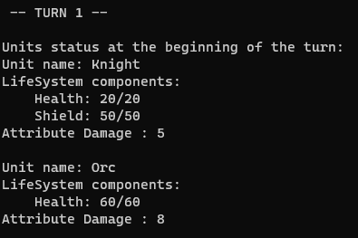
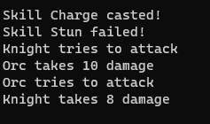
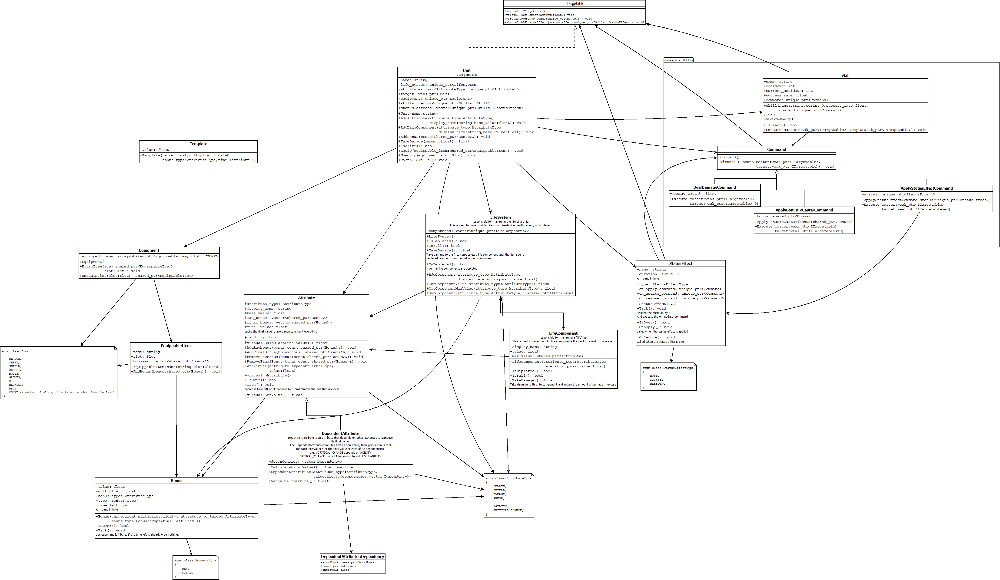

# Human VS Orc




This project is a small simulation of a battle between two RPG units (a human and an orc).


## Goal of this project
The goal of this project is to have a **clean code architecture** and **be modular** to add easily new RPG classes, skills or attributes.

See the [Class Diagram](#class-diagram) for more details about the architecture design.

**Here are the main features implemented:**
- [x] Modular skill system with the use of the [Command Pattern](https://refactoring.guru/design-patterns/command)
- [x] Modular RPG attribute system for units
  - Attributes depending on other attributes (e.g. critcal_chance gaining +1 for each 5 points of agility) can be created.
- [x] Modular "Life System" on top of attributes
  - Used to handle current and max health points, or similar
  - Can be modified during runtime to add a shield, without changing the Unit class implementation
- [x] Modular Bonus system for attributes
  - items can be equipped to add bonuses to attributes
  - skills can add bonuses to attributes
- [x] Modular Status Effect system for units
  - units can be stunned, bleeding, etc...
  - status can be added by skills
- [x] Modular RPG units with attributes and skills that can be added at runtime


## Usage

### How to build and run

Build the project using CMake, while in the root directory of the repository:
  
If you are using a single configuration generator like Unix Makefiles, specify the -DCMAKE_BUILD_TYPE parameter to either "Debug" or "Release" (default is Debug):
  ```bash
  # OPTION 1 : Configure the build in Release
  cmake -S HumanVSOrc -B build -DCMAKE_BUILD_TYPE=Release
  # build the binaries
  cmake --build build

  # OPTION 2 : Configure the build in Debug
  cmake -S HumanVSOrc -B build -DCMAKE_BUILD_TYPE=Debug
  # build the binaries
  cmake --build build
```

Otherwise, if you are using a multi-configuration generator like Visual Studio, do not specify the -DCMAKE_BUILD_TYPE parameter:

```bash
  # Configure the build
  cmake -S HumanVSOrc -B build
  # Build debug binaries
  cmake --build build --config Debug
  # Build release binaries
  cmake --build build --config Release
  ```

The binaries will be located in the ``HumanVSOrc/bin`` folder. It contains the following executables:
- ``HumanVSOrc(.exe)``: the main game/simulation project
- ``TestProject(.exe)``: the unit testing project

These commands will build the project in Release mode. To build in Debug mode, just replace ``Release`` by ``Debug`` in the commands above.


### Unit Testing

Unit testing is done with [Google Test](https://github.com/google/googletest). The tests sources are located in the `HumanVSOrc/TestProject` folder.

To run the tests, you can either run the ``TestProject`` executable (see above) or run the tests in your IDE (e.g. Rider or Visual Studio).


#### Test coverage

I'm using [OpenCppCoverage](https://github.com/OpenCppCoverage/OpenCppCoverage) to generate the test coverage. To generate the report, run the following command in the root directory of the repository:

```bash
OpenCppCoverage.exe --sources HumanVSOrc --excluded_sources gtest --excluded_sources Game -- .\HumanVSOrc\bin\Debug\TestProject.exe
```

It ignores the gtest and Game.cpp files as there is no point to test them.

As of the last commit, the test coverage is 85% although few parts are not tested because they just print debug messages.


## Class Diagram

Here is the class diagram of this project. Note that not all methods nor class attributes are present to keep it as readable as possible. Also, Factory classes are not shown.





## How to use this project

Below are several examples of how to use the classes defined in this project in order to create a new RPG unit, add skills, attributes or items to it.

### How to add a new RPG Unit

Let's say you want to add a new RPG unit called ``Paladin``. No need to create another class, you can add the components you want to the ``Unit`` instance that you create. Here are the steps to follow:

```c++
// 1. Create a new Unit instance
Unit paladin("Paladin");
// 2. Add the attributes you want
paladin.AddAttribute(AttributeType::HEALTH, "Health", 200.0f);
paladin.AddAttribute(AttributeType::DAMAGE, "Damage", 15.0f);
// etc...
// 3. Add the skills you want
paladin.AddSkill(skills::SkillFactory::CreateOverpoweredPaladinSkill()); // See skill creation section for more details
``` 

### How to create a new Skill

Skills are implemented using the [Command Pattern](https://refactoring.guru/design-patterns/command). To create a new skill, you just need to instantiate a new ``Skill`` object with the desired ``Command`` object.

For instance, to create a Fireball skill and add it to the unit, you can do the following using the ``DealDamageCommand`` command:

```c++
Unit unit;
float fireball_damage = 15.0f;
int cooldown = 3; // 3 turns
float success_rate = 0.95f; // 95% chance to succeed
unit.AddSkill(std::make_unique<Skill>("Fireball", cooldown, success_rate, std::make_unique<DealDamageCommand>(fireball_damage)));
```

A ``SkillFactory`` is also available to create predefined skills, e.g. ``SkillFactory::CreateChargeSkill()`` which returns a ``unique_ptr<Skill>``.


### How to add a new RPG attribute

It's easy to add a new attribute to the RPG system and add it to any unit. Not all units are required to have all attributes.

1. First add a new attribute type in the ``AttributeType`` enum in ``AttributeType.h``. For instance ``DEXTERITY``.
2. Then we can just add this attribute at runtime to any unit using the ``AddAttribute`` method. For instance:
```c++
Unit unit;
float base_value = 10.0f;
std::string display_name = "Dexterity";
unit.AddAttribute(AttributeType::DEXTERITY, display_name, base_value);
```


You can also define dependant attributes. For instance, let's say that the ``EVASION`` attribute is defined as ``EVASION = +1 for each 5 points of DEXTERITY``. We can do the following:

```c++
// Define the dependency rules
auto dexterity = unit.GetAttribute(AttributeType::DEXTERITY);
std::vector<DependentAttribute::Dependency> dependencies{
    DependentAttribute::Dependency(dexterity, 1.0f, 5.0f)
  };
// Then create the dependent attribute
unit.AddDependentAttribute(AttributeType::EVASION, "Evasion", 0.0f, dependencies);

```


## Possible Improvements

- Only ``EquippableItem`` items are defined but we could easily add ``Consumable`` items (e.g. potions) with the use of the already implemented ``Command`` pattern.
